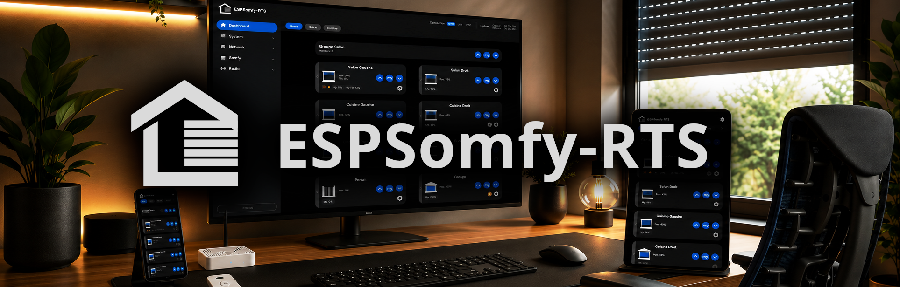

 
 

  

    Contrôlez et gérez facilement vos volets roulants, portails, portes de garage ou tout autre appareil utilisant le protocole RTS 433 MHz.
     
    <a href="https://github.com/xkain/ESPSomfy-RTS/wiki"><strong>Explorer la documentation »</strong></a>
     
     
    <a href="https://github.com/xkain/ESPSomfy-RTS/issues">Signaler un bug</a>
    &middot;
    <a href="https://github.com/xkain/ESPSomfy-RTS/pulls">Demander une fonctionnalité</a>
  

 

[![Product Name Screen Shot][product-screenshot]](https://example.com)

## À propos du projet

Ce projet fait office de contrôleur complet pour les stores et volets Somfy RTS, capable de gérer jusqu'à **30 volets individuels**, **14 groupes** et **14 pièces**.

#### Protocoles pris en charge
* **433MHz RTx :** Prise en charge complète des protocoles **RTS, RTW, RTV/L** et **433,92MHz**.
* **Contraintes de fréquence :** Vous pouvez mélanger les protocoles tant qu'ils se situent dans la même plage de fréquence de base. 
  > **Note :** Vous ne pouvez pas faire fonctionner simultanément des moteurs 433,92MHz et 433,42MHz sur le même émetteur-récepteur radio.
* **IO Homecontrol :** Non pris en charge nativement. Cependant, la compatibilité peut être obtenue via le protocole **IO Remote** en s'interfaçant avec une télécommande désossée. 

#### Moteurs filaires (Relais)
Pour les personnes disposant de moteurs "nus" (sans radio intégrée), ce projet inclut la prise en charge des **configurations de modules relais**. Une fois configurés, ces moteurs peuvent être contrôlés via l'interface exactement comme des appareils natifs RTS ou RTW.

 

### Pourquoi ce projet existe-t-il ?

**ESPSomfy-RTS** est un projet puissant à la base, mais j'ai estimé qu'il avait besoin d'une touche plus moderne et localisée.

Étant français (et donc un grand amateur de pain et de fromage), j'ai trouvé lors de ma toute première utilisation que les explications étaient parfois confuses. Surtout, j'avais l'impression de devoir mettre des lunettes de soleil à chaque fois que j'ouvrais l'interface ! Ce fork est conçu pour vous éviter un aller-retour chez l'ophtalmo et quelques maux de tête linguistiques au passage.

Tout en conservant les **fondations ultra-solides** du projet original, j'ai entièrement repensé l'expérience utilisateur pour la rendre **véritablement responsive** : l'interface est tout aussi agréable à utiliser sur mobile et tablette que sur PC, et la navigation est enfin limpide pour les non-anglophones.

Ce projet vise à rendre la gestion de vos appareils RTS 433 MHZ aussi belle que fonctionnelle.

 

## Migration & Mises à jour

Si vous migrez depuis **rstrouse/ESPSomfy-RTS** ou si vous mettez à niveau une ancienne version de ce fork, veuillez lire ce qui suit :

#### De rstrouse à ce Fork (v2.5.0+)
* **Compatibilité des données :** Vous pouvez restaurer un fichier `.backup` du projet original. Vos volets, groupes et adresses de télécommandes seront migrés avec succès.
* **⚠️ Paramètres Radio (Action requise) :** En raison du nouveau sélecteur de GPIO dans la v2.5.0, les assignations des broches radio ne sont **pas** restaurées automatiquement à partir des anciens fichiers de sauvegarde. 
* **Message d'avertissement :** Vous verrez une alerte de compatibilité pendant le processus de restauration. Après l'importation, vous **devez** vérifier et réassigner manuellement vos broches GPIO dans l'onglet **Radio**.

#### Mise à niveau de la v2.4.8 à la v2.5.0
* **Mise à jour directe :** Vos paramètres existants sont automatiquement migrés et préservés pendant le processus de mise à jour. 
* **⚠️ Note sur la sauvegarde automatique :** Le fichier de sauvegarde créé par le système *juste avant* la mise à jour est toujours à l'ancien format. 
* **Restauration après mise à jour :** Si jamais vous devez restaurer cette sauvegarde spécifique pré-mise à jour sur la v2.5.0+, vous déclencherez l'alerte "Compatibilité incomplète" et devrez réassigner vos GPIO Radio manuellement.

> [!TIP]
> Après une mise à jour réussie vers la v2.5.0, nous vous recommandons de créer immédiatement une **nouvelle sauvegarde**. Ce nouveau fichier inclura la cartographie GPIO mise à jour et ne déclenchera plus aucun avertissement à l'avenir.

## Home Assistant

Ce fork reste 100% compatible avec l'intégration officielle ESPSomfy-RTS-HA. Si vous utilisez déjà l'intégration, mettez simplement à jour votre ESP32 avec ce firmware. Vos entités, noms et tableaux de bord dans Home Assistant continueront de fonctionner sans aucune modification.

## Feuille de route du projet ESPSomfy-RTS

Vous voulez savoir ce qui arrive ensuite, suivre l'avancement de la version en cours ou voir les fonctionnalités terminées ? J'utilise GitHub Projects pour maintenir une feuille de route en direct et à jour.

> 💡 **Cliquez sur le badge ci-dessus** pour suivre le développement en temps réel, les jalons actifs (`v2.5.3`, `v3.0.0`), et soumettre des fonctionnalités ou des corrections de bugs directement dans les colonnes de notre flux de travail.

 

## 🛠️ Dépannage & Réinitialisation d'usine

Si vous perdez l'accès à l'interface web (erreur de configuration réseau ou mot de passe oublié), une procédure de réinitialisation manuelle est disponible via des cycles d'alimentation (**Power Cycles**).

> [!IMPORTANT]
> La procédure dépend de la version de votre firmware. Un système à deux niveaux a été introduit dans la **v2.5.1** pour permettre de réinitialiser le réseau sans perdre toutes vos configurations (ce qui n'est pas le cas si vous utilisez la version **2.5.0**).

### Résumé des procédures

* **Version v2.5.1+ :**
    * **3 Cycles :** Réinitialise la configuration Wi-Fi et désactive les paramètres de sécurité.
    * **6 Cycles :** Réinitialisation d'usine complète (**Full Wipe**).
* **Version v2.5.0 :**
    * **4 Cycles :** Réinitialisation d'usine complète (**Full Wipe**).

### 📖 Documentation complète
Pour voir les instructions détaillées et les diagrammes de cycles, veuillez consulter la page dédiée :

👉 **[Voir la page de Factory Reset](https://github.com/xkain/ESPSomfy-RTS/wiki/Factory-Reset)**

> [!TIP]
> Utilisez toujours ces procédures en dernier recours. Si l'interface est toujours accessible, utilisez plutôt le bouton **Restaurer** dans les paramètres système.

---

## 📸 Captures d'écran

### 📱 Vue Mobile (Mode Sombre)

  
  
  
  

### 💻 Vue Bureau (Mode Sombre)

    
    
  

 

<b>✨ Cliquez ici pour voir les versions en Mode Clair</b>

  
### 📱 Vue Mobile 

  
  
  
  

### 💻 Vue Bureau   

    
    
  

    
---

## 📚 Documentation & Ressources

Puisqu'il s'agit d'un fork, vous pouvez vous appuyer sur la riche documentation originale pour les détails matériels techniques et les intégrations :

* 📖 **[Configuration du logiciel](https://github.com/rstrouse/ESPSomfy-RTS/wiki/Configuring-the-Software)**
* ⚙️ **[Installation du firmware](https://github.com/rstrouse/ESPSomfy-RTS/wiki/Installing-the-Firmware)**
* 🔄 **[Comment mettre à jour ESPSomfy RTS](https://github.com/rstrouse/ESPSomfy-RTS/wiki/Updating-ESPSomfy-RTS)**
* 🔌 **[Intégrations](https://github.com/xkain/ESPSomfy-RTS/wiki/Intégrations)**

---

## 🙏 Crédits
Un merci tout particulier à [rstrouse](https://github.com/rstrouse) pour son travail incroyable sur le projet original ESPSomfy-RTS

---

## 📦 Boîtiers Prêts à l'Emploi (Plug & Play)

Si vous ne souhaitez pas fabriquer le matériel vous-même, je propose des **unités entièrement assemblées, flashées et testées individuellement** avant envoi. Ces boîtiers sont prêts à être alimentés pour piloter immédiatement vos équipements Somfy RTS 433 MHz.

🛒 **Disponibles à l'achat sur [Leboncoin](https://www.leboncoin.fr/profile/77a39e2a-ddb5-44c8-828a-954652c46ee7)**

> [!IMPORTANT]
> **💡 Note sur la configuration et l'assistant intégré**
> 
> **L'assistant de préconfiguration automatique a déjà été exécuté par mes soins sur votre boîtier avant son expédition.** Votre appareil est donc configuré et prêt à l'emploi dès la première mise sous tension :
> * Interface entièrement en **Français**.
> * Fuseau horaire local configuré (**Europe/Paris**).
> * Module radio **activé** et **GPIO spécifiques** à votre modèle déjà assignés.
>
>Pour retrouver toutes les caractéristiques et détails, une page dédiée aux **[boîtiers](https://github.com/xkain/ESPSomfy-RTS/wiki/BO%C3%8ETIERS-LEBONCOIN)** est disponible.
>
> ⚠️ **En cas de perte de configuration :** Si après une mise à jour majeure ou une réinitialisation d'usine (*Factory Reset*) vos équipements ne répondent plus, pas de panique ! L'assistant reste disponible dans l'interface web.

  

  
  
  

<!-- MARKDOWN LINKS & IMAGES -->
[product-screenshot]: images/exemple.png
[product-hardreset]: images/hard-reset.GIF
